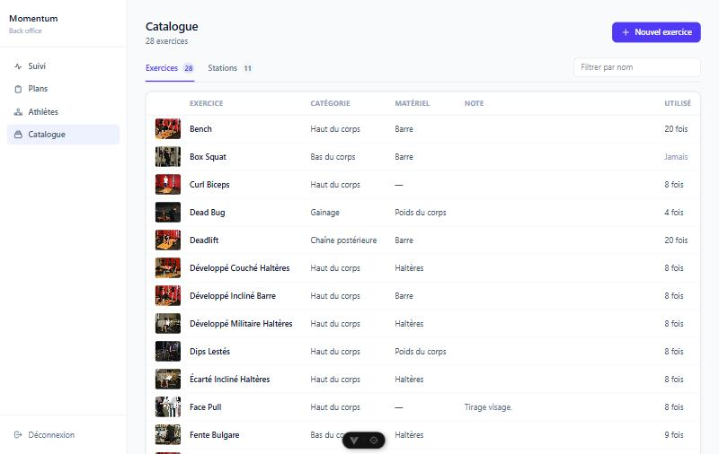
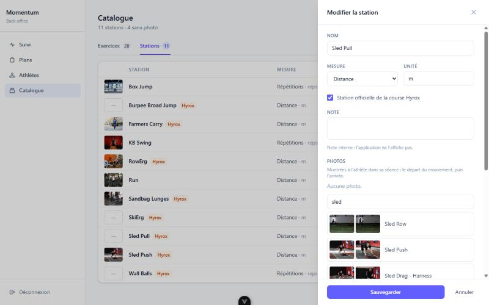
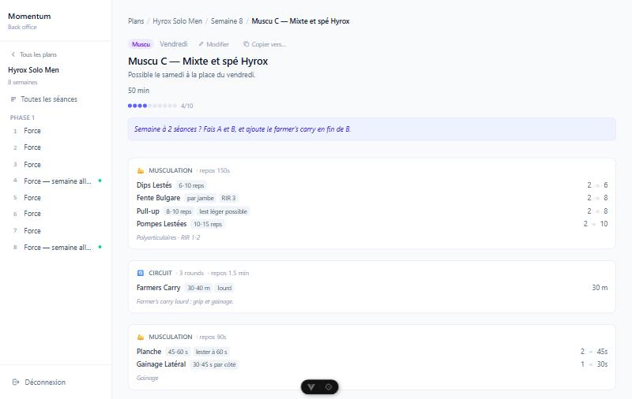

# Étape 3, lot 3 — gérer le catalogue, afficher les notes

Date : 2 octobre 2026. Suite de `2026-10-02-plans-creation-design.md`. Spec et plan condensés dans ce seul document.

## But

Les exercices et les stations se choisissent dans le CRM mais ne s'y gèrent pas : il a fallu un script pour en créer et pour leur donner des photos. Et le CRM cache les notes de ligne (« 6-8 reps · RIR 2 »), que l'athlète lit pourtant dans l'app : 128 lignes d'exercice sur 303 en portent une.

## Ce que fait le coach

**Page « Catalogue »** (`/catalogue`), deux onglets : Exercices et Stations.

| Geste | Résultat |
|---|---|
| Lire la liste | vignette, nom, catégorie et matériel (ou mesure, unité, pastille « Hyrox »), note, nombre d'utilisations ; le sous-titre compte les entrées sans photo |
| Filtrer | par nom, sans casse ni accent |
| Ajouter, modifier | tiroir : nom, listes fermées de Directus, note, photos |
| Trouver des photos | recherche par nom anglais dans free-exercise-db, la banque dont viennent déjà les photos de l'app ; un clic pose les deux photos du mouvement |
| Ajouter une photo à la main | coller une adresse en https |
| Supprimer | seulement une entrée qui ne sert nulle part : ni dans une séance, ni dans une saisie d'athlète |

**Notes affichées** : dans le détail d'une séance, la note d'un exercice ou d'une station s'affiche en pastilles à côté du nom, comme dans l'app.

## Règles

- Catégories, matériel et types de mesure sont les listes fermées de Directus, avec un libellé français. Une valeur inconnue de la liste reste affichée telle quelle.
- Deux entrées d'un même catalogue ne portent pas le même nom, à la casse et aux accents près.
- La note d'un exercice est celle que l'app montre dans sa fiche (alternative, matériel). Celle d'une station reste interne : l'app ne l'affiche pas.
- La banque de photos se charge à la première recherche (150 Ko compressés), depuis le même CDN que les photos. Les résultats vont du nom le plus court au plus long : les mouvements de base avant leurs variantes.
- Supprimer une entrée utilisée viderait la référence des lignes qui la portent (`ON DELETE SET NULL`) : la séance perdrait l'exercice sans prévenir. D'où la garde :
  - les collections à compter se lisent dans les relations de Directus, pas dans une liste écrite en dur : une collection ajoutée plus tard (saisie des stations) est comptée d'office ;
  - le décompte est relu juste avant de supprimer ;
  - sans décompte, rien ne se supprime.

## Code

- `src/utils/catalog.ts` : recherche de photos, nettoyage des adresses, contenu envoyé à Directus, décompte et garde de suppression, découpe des notes. Testé (`tests/catalog.test.ts`).
- `src/constants/catalog.ts` : listes fermées et libellés. Le formulaire de musculation les reprend pour grouper les exercices.
- `src/stores/catalog.ts`, `src/composables/useDirectus.ts` (`fetchCatalogUsage`) : lecture, écriture, décompte.
- `src/views/CatalogView.vue`, `src/components/catalog/CatalogDrawer.vue`, `ImagePicker.vue`.
- `src/components/ui/NoteChips.vue`, repris par les cinq blocs à lignes de `src/components/session/blocks/`.

Corrigé au passage : un décompte groupé sans `limit: -1` ne renvoie que 100 groupes. La lecture de la dernière série par athlète (lot 1) en dépendait ; au-delà de 100 athlètes, certains seraient passés pour inactifs.

## Plan

- [x] Tests puis `catalog.ts`.
- [x] Store et lectures Directus.
- [x] Page, tiroir, recherche de photos ; entrée de menu.
- [x] Notes dans les cinq blocs à lignes.
- [x] Vérification sur la copie locale en mémoire ; `npm test`, `npm run build`.

## Vérifié

Sur la copie locale en mémoire (aucune écriture en prod) : liste et décomptes conformes à un comptage direct ; création, modification, choix de photos dans la vraie banque, adresse collée, suppression d'une entrée inutilisée ; suppression refusée quand l'entrée sert dans un plan, dans une saisie d'athlète, quand elle vient d'être ajoutée à une séance après l'ouverture du tiroir, et quand le décompte ou les relations sont illisibles ; pannes d'écriture et de banque de photos.

En lecture seule sur le vrai Directus : les relations vers les catalogues, et la forme exacte des décomptes groupés envoyés par le SDK.

## Limites

- La banque n'a pas de mouvement pour SkiErg, Sled Pull, Wall Balls et Burpee Broad Jump : il faut coller une adresse.
- Une photo est une adresse, pas un fichier : rien ne s'envoie dans Directus.
- Catégorie mise à part (elle groupe les exercices dans l'éditeur de séance), matériel, mesure et unité ne servent qu'à lire le catalogue.
- Écritures et suppression n'ont pas tourné sur le vrai Directus.
